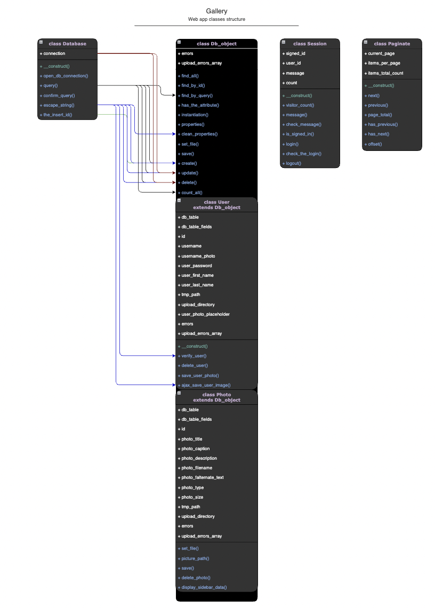

# Basic PHP Gallery
> Gallery system based on the cource "PHP OOP: Object Oriented Programming for beginners + Project" 
> Cource can be found [_here_](https://www.udemy.com/course/oop-php-object-oriented-programing-with-project-1-course/).

## Table of Contents
* [General Info](#general-information)
* [Technologies Used](#technologies-used)
* [Features](#features)
* [Screenshots](#screenshots)
* [Setup](#setup)
* [Project Status](#project-status)
* [Contact](#contact)
<!-- * [License](#license) -->

## General Information
- The purpose of the project is to master PHP OOP. 

## Technologies Used
- PHP - [version 7.*](https://www.php.net/)
- Bootstrap - [version 3.3.2](http://getbootstrap.com)
- Jquery - [version 1.11.1](https://code.jquery.com/)
- MySQL DB

## Features
- Summernote, WYSIWYG Editor on Bootstrap - [Summernote](https://summernote.org/)
- Google API Chart - [Pie Chart](https://developers.google.com/chart/interactive/docs/gallery/piechart)

## Screenshots

## Setup for local environment
- Install [PHP 7.*](https://www.php.net/)
- Used development environment [XAMPP](https://www.apachefriends.org/index.html)
- php.ini configurations:
`file_uploads=True, 1, or On`
`post_max_size=8M`
`upload_max_file_size=2M`
`memory_limit=128M`
`max_input_time=-1 or -no limit`
`max_execution_time=30 seconds`
- Permissions on upload directory for files
`gallery/admin/images : Read & Write`

## Project Status
Project is: _in progress_

## Contact
Created by [@Lilyana Vankova](https://github.com/Lilyah) - feel free to contact me!

<!-- Optional -->
<!-- ## License -->
<!-- This project is open source and available under the [... License](). -->

<!-- You don't have to include all sections - just the one's relevant to your project -->
